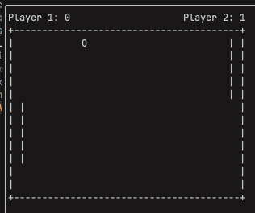

# Pong


A terminal-based Pong game written in C.



But Pong is only the beginning.

This project is about understanding systems from first principles — starting with something small enough to understand completely, then using each problem as a reason to go deeper.

Build something. Hit a wall. Understand why. Build again.

## Why

Understanding how things work underneath the abstractions.

How does memory actually work?
How does state move through a program?
How does a system communicate?
How does an algorithm become an implementation?
How does a neural network actually learn?

Instead of trying to learn all of these things separately, this project is a place to encounter them naturally.

Pong is the first step.

## What it does

The game currently runs entirely in the terminal and includes:

* Two paddles and a ball
* Ball and paddle collision
* Angle-based bouncing
* Score tracking and resets
* Keyboard controls
* A simple heuristic AI opponent

The AI does not learn yet. It simply tracks the ball.

That is intentional. The current game is the foundation for what comes next.

## Getting started

### Requirements

You need:

* A C compiler (`clang` or `gcc`)
* `make`
* A Unix-like terminal

### Build

```sh
git clone git@github.com:noosforge/pong.git
cd pong
make
```

### Run

```sh
./pong
```

The game takes over the terminal and uses raw keyboard input.

### Controls

| Key | Action           |
| --- | ---------------- |
| `w` | Move paddle up   |
| `s` | Move paddle down |
| `q` | Quit             |

If the terminal is left in an unusual state after the program is interrupted, run:

```sh
reset
```

## Where this is going

The current heuristic AI will eventually be replaced by a neural network written from in C.

The goal is not simply to make an AI that plays Pong. It is to understand what is happening underneath:

* Linear algebra
* Neural networks
* Forward propagation
* Backpropagation
* Optimization
* Training
* Inference

The network will eventually live behind the same `ai_move_paddle()` interface that the current AI uses.

And Pong will eventually become just one small piece of a much larger journey into systems, machine learning, and understanding how things work from the bottom up.
